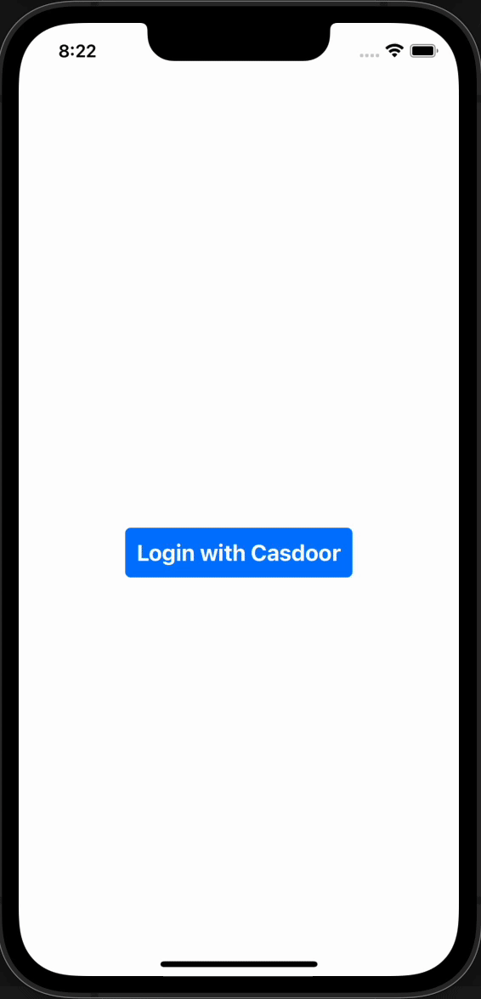
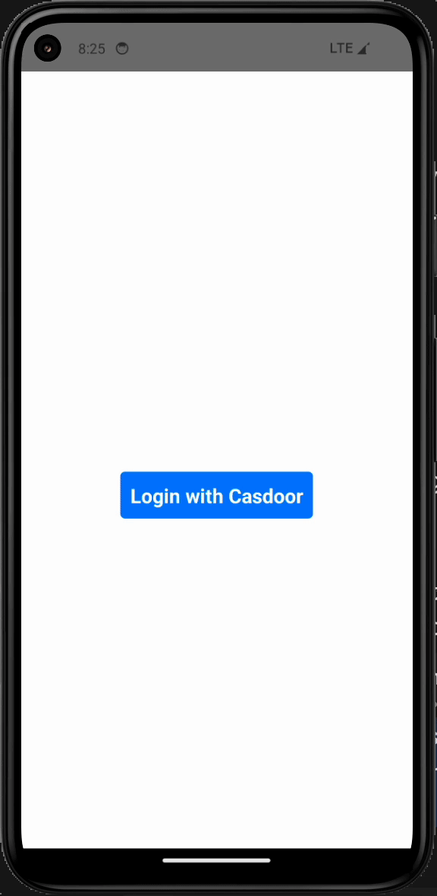

# casdoor-react-native-example

This example uses [casdoor-react-native-sdk](https://github.com/casdoor/casdoor-react-native-sdk).
This example describes how to use casdoor in [react-native](https://reactnative.dev/).

## Quick Start

- download the code

```bash
 git clone git@github.com:casdoor/casdoor-react-native-example.git
```

- install dependencies
```bash 
 cd casdoor-react-native-example
 yarn install
 cd ios/
 pod install
```
- run on ios
```bash
cd casdoor-react-native-example
react-native start
react-native run-ios
```
- run on android
```bash
cd casdoor-react-native-example
react-native start
react-native run-android
```
>Make sure to turn on the emulator or real device before running.

## After running, you will see the following  interfaces:

|                           **iOS**                           |                         **Android**                          |
| :---------------------------------------------------------: | :----------------------------------------------------------: |
|  |  |


## Configure

Initialization requires 7 parameters, which are all str type:
| Name         | Must | Description                                            |
| ------------ | ---- | ------------------------------------------------------ |
| serverUrl    | Yes  | Casdoor Server Url, such as `https://door.casdoor.com` |
| redirectPath | Yes  | redirectPath                                           |
| appName      | Yes  | Application name                                       |
| clientId     | Yes  | Your client id                                         |
| organizationName     | Yes  | the name of the Casdoor organization connected with your Casdoor application                    |
| signinPath     | No  | the path of the signin URL for your Casdoor application, will be `/api/signin` if not provided              |


```javascript
  const sdkConfig = {
  serverUrl: 'https://door.casdoor.com',
  clientId: 'b800a86702dd4d29ec4d',
  appName: 'app-example',
  organizationName: 'casbin',
  redirectPath: 'http://localhost:5000/callback',
  signinPath: '/api/signin',
};
```

## License

This project is licensed under the [Apache 2.0 license](https://github.com/casdoor/casdoor-dotnet-sdk/blob/master/LICENSE).
