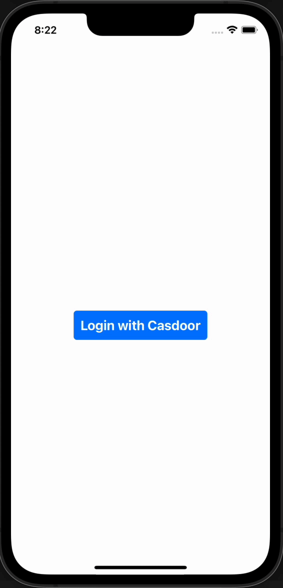
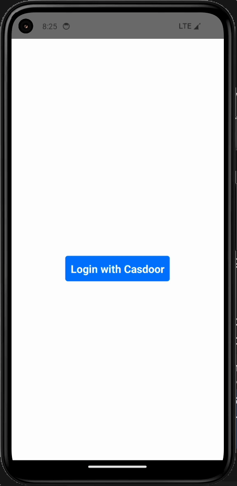

# Casdoor React Native Example

[](https://github.com/casdoor/casdoor-react-native-example/actions/workflows/build.yml)
[](https://github.com/casdoor/casdoor-react-native-example/blob/master/LICENSE)
[](https://discord.gg/5rPsrAzK7S)

An example [React Native](https://reactnative.dev/) app, built with [Expo](https://expo.dev/), that signs users in with [Casdoor](https://casdoor.ai/) using [casdoor-react-native-sdk](https://github.com/casdoor/casdoor-react-native-sdk).

| iOS | Android |
|:---:|:-------:|
|  |  |

## How it works

1. **Login with Casdoor** calls `sdk.signin(WebBrowser.openAuthSessionAsync)` ([App.js](App.js)). The SDK creates a PKCE code verifier and a random state, and opens the Casdoor sign-in page with [expo-web-browser](https://docs.expo.dev/versions/latest/sdk/webbrowser/).
2. After signing in, Casdoor redirects back to the app's redirect URL, which closes the browser and returns the URL to the SDK.
3. The SDK checks the state and exchanges the code for the access token with the code verifier, so no client secret is stored in the app.
4. The app reads the user from the access token (`sdk.JwtDecode()`) and shows the avatar, name and email. **Logout** clears the stored state.

## Prerequisites

- Node.js 20+ and Yarn
- [Expo Go](https://expo.dev/go) on your phone, or an iOS simulator / Android emulator
- A Casdoor server. The example is preconfigured for the public demo server https://door.casdoor.com, so it runs as is. To use your own, see [Casdoor installation](https://casdoor.ai/docs/basic/server-installation).

## Configuration

Skip this section to try the example with the public demo server.

In your Casdoor, create (or reuse) an organization and an application. Then fill in `sdkConfig` in [App.js](App.js):

| Name             | Description                                                    |
|------------------|----------------------------------------------------------------|
| serverUrl        | Casdoor server URL                                             |
| clientId         | Client ID of the application                                   |
| appName          | Name of the application                                        |
| organizationName | Organization of the application                                |
| redirectPath     | The redirect URL, from `AuthSession.makeRedirectUri()`         |

```javascript
const sdkConfig = {
  serverUrl: 'https://door.casdoor.com',
  clientId: 'b800a86702dd4d29ec4d',
  appName: 'app-example',
  organizationName: 'casbin',
  redirectPath: AuthSession.makeRedirectUri({path: 'callback'}),
};
```

`makeRedirectUri()` returns a different URL in each environment, add the one you use to the **Redirect URLs** of your application:

| Environment       | Redirect URL                       |
|-------------------|------------------------------------|
| Development build | `casdoorexample://callback`        |
| Expo Go           | `exp://<your-ip>:8081/--/callback` |
| Web               | `http://localhost:8081/callback`   |

The `casdoorexample` scheme is set in [app.json](app.json), change it to your own scheme.

## Run

```shell
git clone https://github.com/casdoor/casdoor-react-native-example
cd casdoor-react-native-example
yarn install
yarn start
```

Then scan the QR code with Expo Go on your phone, or press `i` for the iOS simulator, `a` for the Android emulator and `w` for the web. On the demo server, sign in with username `admin` and password `123`.

Run the tests:

```shell
yarn test
```

## Resources

- [Casdoor documentation](https://casdoor.ai/docs/overview)
- [casdoor-react-native-sdk](https://github.com/casdoor/casdoor-react-native-sdk)
- [Expo: authentication with AuthSession](https://docs.expo.dev/guides/authentication/)

## License

[Apache-2.0](LICENSE)
